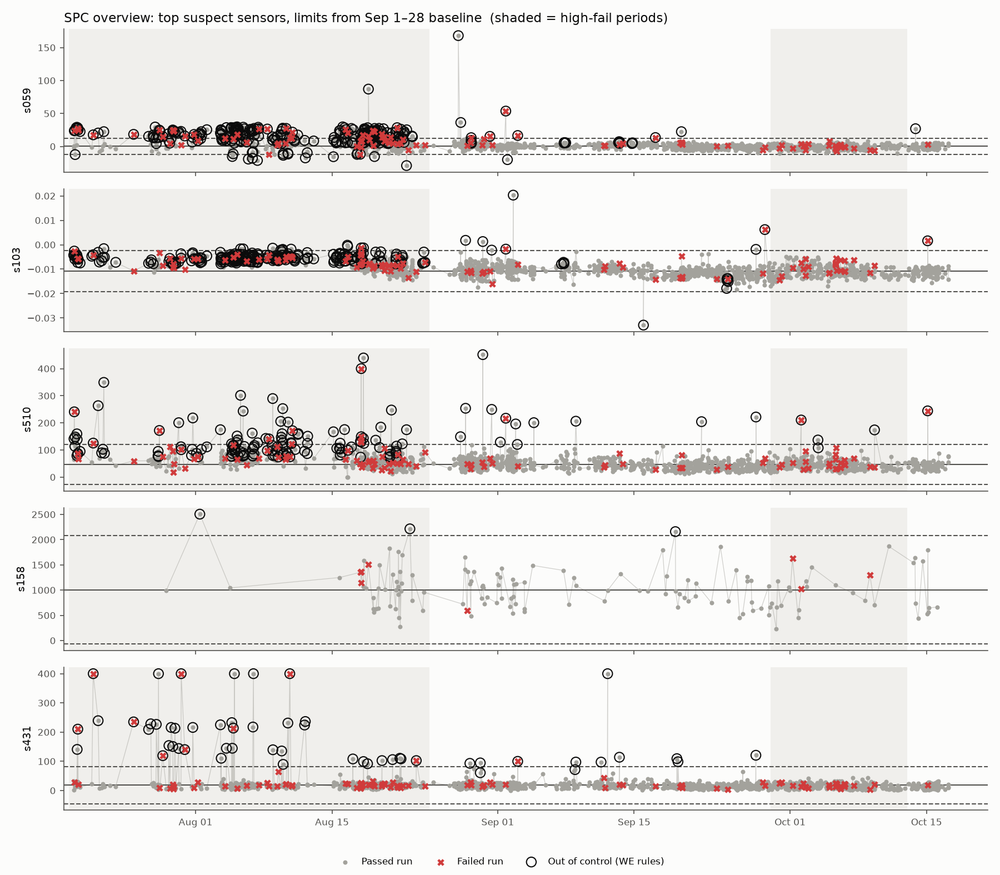
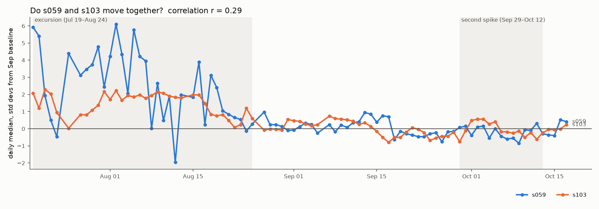
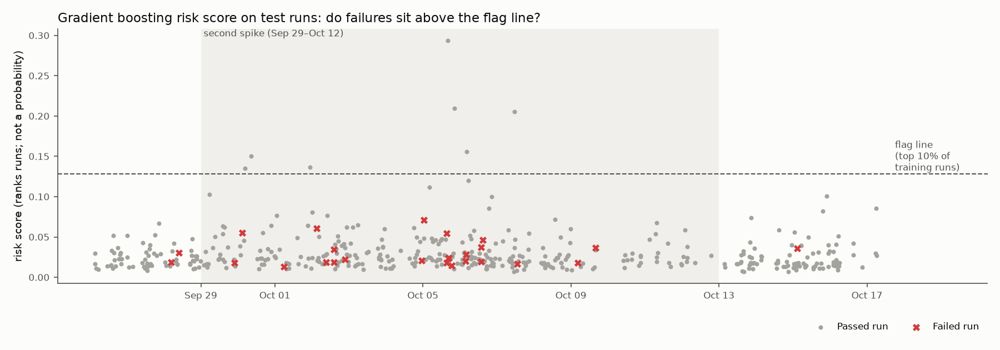
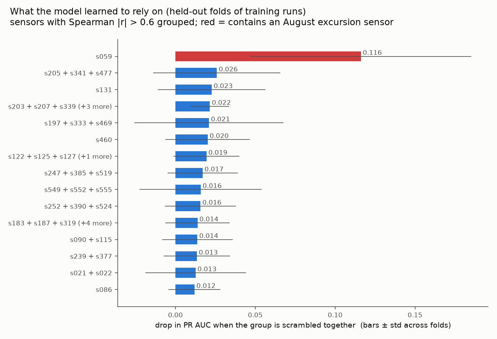
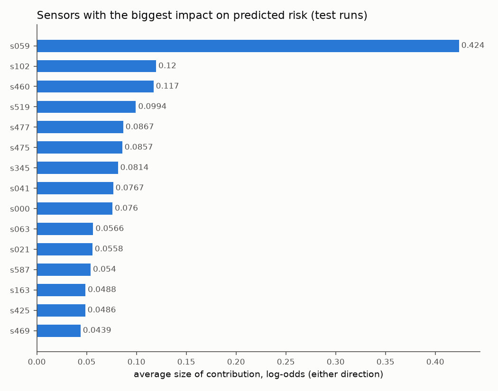
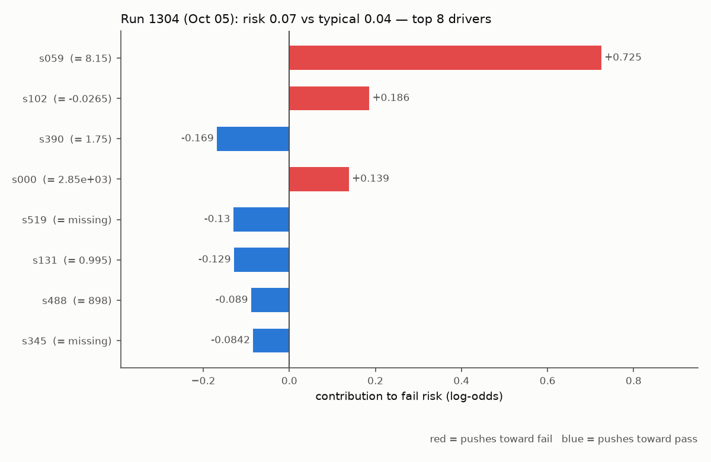
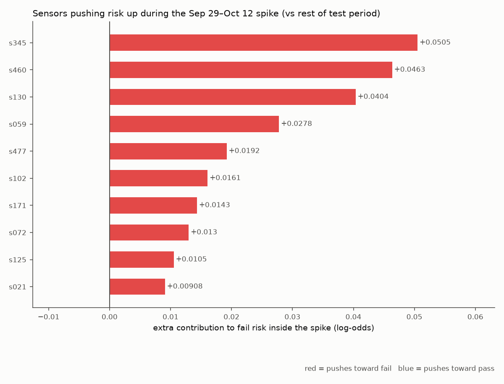

# Fab-RCA: Root-Cause Analysis on Semiconductor Fab Data

I built an end-to-end troubleshooting pipeline on real semiconductor manufacturing data: SQL ingestion, statistical process control (SPC), failure-prediction models, and SHAP explanations of individual runs. The goal was to answer the question a process engineer asks when yield drops: **which runs are at risk, and which signals point to the cause?**

## Summary

- **SPC found a real process excursion.** From late July to Aug 24 the weekly fail rate ran at 10–21%, then dropped to 1.5–4% in September. Sensors s059, s103 and s510 were out of control on 29–61% of excursion runs versus 1.5–3% of healthy runs, and runs they flagged failed about 3× as often.
- **Textbook SPC limits failed on this data, and I fixed them.** Runs arrive in bursts of near-identical readings, so moving-range control limits came out far too tight and flagged 16–36% of a healthy month. Estimating sigma from the baseline's standard deviation brought false alarms down to 1.5–3% while keeping the excursion signal.
- **Random cross-validation made the model look useful. A time-ordered test showed it wasn't.** Gradient boosting scored PR AUC 0.175 under random 5-fold CV, but 0.067 when trained on earlier runs and tested on later ones. That is the same as random guessing (0.066, luck range 0.045–0.113).
- **The model learned August's failure mode, and October's was different.** s059 dominates what the model relies on (about 4× any other sensor group), but s059 was back to normal after Aug 26. The second fail spike (Sep 29–Oct 12) had a different cause, and the model caught none of its 23 failures.
- **Retraining helps a little, but not enough on its own.** Replaying production with weekly retraining roughly tripled logistic regression's precision (the only improvement whose 95% interval excludes zero). It did not help gradient boosting, and no strategy caught more than 4 of the 23 spike failures.
- **Recommendation:** a one-time model is not a safe troubleshooting tool for a process that changes. In practice I would pair SPC on the inputs with frequent retraining, and add anomaly detection so the tool can flag *new* kinds of deviation, not just ones it has seen fail before.

## Data

[SECOM dataset](https://archive.ics.uci.edu/dataset/179/secom) (UCI Machine Learning Repository, McCann & Johnston, 2008). Real data from a semiconductor fab, Jul 19 – Oct 17, 2008.

- **1,567 production runs**, each labelled pass or fail by end-of-line testing
- **590 sensor and metrology readings per run**, anonymized (no sensor names, tool IDs or process steps)
- **104 failures (6.6%)**

## Pipeline

| Step | Script | What it does |
|---|---|---|
| 1. Ingest | `load_secom.py` | Loads the raw files into SQLite (`data/secom.db`): `runs`, `measurements` (924,530 readings in long format, missing kept as NULL) and `sensors` (per-sensor data-quality stats) |
| 2. Explore | `explore_secom.py` | Ranks sensors by how differently they read on failed runs; fail rate by week |
| 3. SPC | `spc.py` | Individuals control charts with Western Electric rules for the top suspect sensors |
| 4. Model | `model.py` | Logistic regression and gradient boosting, tuned and evaluated on time-ordered splits |
| 5. Explain | `explain.py` | SHAP breakdown of each run's risk score into per-sensor contributions |
| 6. Retrain | `retrain.py` | Week-by-week production replay comparing retraining strategies |

```
python -m venv .venv
.venv\Scripts\activate.bat
python -m pip install -r requirements.txt
python load_secom.py
python explore_secom.py
python spc.py
python model.py
python explain.py
python retrain.py
```

## 1. Data exploration

| Finding | Number |
|---|---|
| Fail rate | 6.6% (104 / 1,567) |
| Constant sensors (no information) | 116 of 590 (20%) |
| Sensors more than 50% missing | 28 |
| Fully populated sensors | 52 |
| Missing readings overall | 4.5% (41,951 of 924,530) |

**Class imbalance drives every later choice.** A model that always predicts "pass" is 93.4% accurate and completely useless, so I report precision, recall and PR AUC instead of accuracy throughout.

**Failures cluster in time.** The weekly fail rate was 10–21% from late July through Aug 24, fell to 1.5–4.2% through September, and rose again to 8.9% in the week of Sep 29. Clustering like this points to process excursions rather than random defects. (Volume also ramped from 13 to about 200 runs per week over July–August, so the earliest weeks are noisy.)

**The strongest single-sensor signals are modest.** s059 averaged 8.5 on failed runs versus 2.6 on passing runs (effect size 0.62), followed by s103 and s510. No single sensor separates pass from fail on its own.

**Missing data is mostly by design.** Ten sensors go missing together on about 65% of runs, which looks like a metrology step that only samples some lots, a normal fab practice. Missingness was only a weak failure signal (64.5% missing on passing runs vs 71.2% on failed).

## 2. Statistical process control

I built Individuals control charts with limits (mean ± 3σ) set from a healthy baseline (Sep 1–28, about 3% fail rate) and flagged runs with Western Electric rules.

### Textbook limits failed, so I diagnosed and corrected them

The textbook method estimates sigma from the average difference between consecutive runs, and uses all four Western Electric rules. On this data it flagged up to a third of the *healthy* baseline:

| Sensor | Baseline flagged (textbook) | Baseline flagged (corrected) | Excursion flagged (corrected) | Fail rate when flagged | Fail rate in control |
|---|---|---|---|---|---|
| s059 | 25.1% | **3.1%** | **61.0%** | 16.3% | 4.4% |
| s103 | 35.9% | **2.6%** | **53.0%** | 14.1% | 5.2% |
| s510 | 16.1% | **1.5%** | **28.7%** | 15.8% | 5.7% |
| s158 | 1.9% | 1.9% | 5.1% | 0.0% | 5.9% |
| s431 | 19.6% | 1.6% | 9.4% | 18.5% | 6.2% |

**Cause:** runs arrive in bursts of near-identical readings (autocorrelation). Consecutive runs inside a burst barely differ, so the moving-range estimate of sigma is far too small and the limits too tight. The "8 in a row on one side" rule also assumes independent runs.

**Fix:** sigma from the baseline's overall standard deviation, and rule 4 dropped. Healthy-period false alarms fell to 1.5–3.1% for every sensor while the excursion signal held.



### Findings

1. **s059, s103 and s510 shifted during the excursion** and returned to baseline in the same window, Aug 17–26, when the fail rate dropped. That fits one corrective action, or related ones, that week. With real fab data, my next step would be the maintenance and recipe-change logs for those dates.
2. **They failed in different ways.** s103 showed a steady level shift (about +2σ for three weeks), consistent with a setpoint, calibration or recipe offset. s059 was unstable, with daily medians swinging from −2σ to +6σ, consistent with an intermittent fault such as a wearing part or unstable flow.
3. **s103 and s510 probably share a cause** (r = 0.61). s059 is largely independent of both.
4. **None of them explains the second spike** (Sep 29–Oct 12). All three stay in control through it.
5. **Ruled out:** s431 (no excursion signal once limits were corrected; its spikes clip at exactly 400, which suggests sensor saturation) and s158 (a sampled sensor with only about 140 readings and no consistent signal).



## 3. Predicting failures

**Setup:** 444 sensors (kept or dropped based on training runs only), logistic regression and gradient boosting, both with class weighting for the 6.6% fail rate. Hyperparameters were tuned on time-ordered folds of the training runs only.

**Test design:** I trained on the earliest 70% of runs (Jul 19 – Sep 26, 78 failures) and tested on the latest 30% (Sep 26 – Oct 17, 26 failures). That mirrors real use: learn from history, then score new production. I also ran random 5-fold cross-validation for comparison.

### Results

| Model | Test method | ROC AUC | PR AUC | PR AUC 95% range |
|---|---|---|---|---|
| Random guessing | time-ordered | 0.500 | 0.066 | 0.045–0.113 |
| Logistic regression | random 5-fold CV | 0.658 | 0.125 | |
| Logistic regression | **time-ordered** | 0.588 | **0.067** | 0.042–0.107 |
| Gradient boosting | random 5-fold CV | 0.712 | 0.175 | |
| Gradient boosting | **time-ordered** | 0.567 | **0.067** | 0.043–0.114 |

**Random CV overstated the model by 2.6×.** Shuffling spreads each burst of near-identical runs across training and test, so the model recognizes a test run's near-twin instead of learning failure patterns. Shuffling also lets the model learn from October to predict July. The time-ordered score is the honest one, and it is indistinguishable from random guessing.

**At an engineer's operating point it caught nothing.** With the flag line set at the riskiest 10% of training runs, gradient boosting flagged 7 test runs and caught 0 of 26 failures (random flagging of 45 runs would catch about 3). Risk scores were calibrated on August, when s059 was abnormal; once s059 returned to normal, almost no test run crossed the line.



**Rolling evaluation** (train on everything earlier, test on the next ~12 days) shows the skill comes and goes. Logistic regression reached 4.3× random on Oct 5–17, and gradient boosting 9.9× on Sep 11–23. Both were at chance (0.95–1.21×) on Sep 23 – Oct 5, the start of the spike. Each window holds only 6–22 failures, so single-window numbers are noisy.

## 4. What the model learned

### Grouped permutation importance (held-out training folds)

Correlated sensors (Spearman |r| > 0.6) were scrambled together, so one partner can't hide another's importance.

| Rank | Sensor group | Drop in PR AUC |
|---|---|---|
| 1 | **s059** | **0.116** |
| 2 | s205 + s341 + s477 | 0.026 |
| 3 | s131 | 0.023 |
| 4 | s203 + s207 + s339 (+3 more, incl. s475) | 0.022 |
| 5 | s197 + s333 + s469 | 0.021 |
| 6 | s460 | 0.020 |
| 7 | s122 + s125 + s127 + s130 | 0.019 |
| 8 | s247 + s385 + s519 | 0.017 |

s059 is about 4× any other group, and its error band is the only one that stays clear of zero. **The model is essentially an August-excursion detector.** s103 + s510 rank 174 of 208: once s059 carried the August signal, they added nothing.



### SHAP: why each run gets its score

SHAP splits each run's risk score into per-sensor contributions (in log-odds) that add up exactly to the model's output. I verified that on every test run.

**The two methods agree.** Of SHAP's six highest-impact sensors on the test runs (s059, s102, s460, s519, s477, s475), five belong to the top eight groups above. Sensors that both improved accuracy in training and drive predictions on new runs are the most trustworthy root-cause leads.



**The three riskiest failed test runs all fall inside the October spike** (Sep 30, Oct 2 and Oct 5), and none crossed the flag line (risk 0.06–0.07). Their top drivers were s102, s519, s163, s460, s021 and s345. Run 1304 (Oct 5) stands out: s059 read 8.1, about 2σ above its September centre, and contributed +0.73 log-odds, the largest single push in any of the three. That suggests s059 may have been creeping up again in early October, below the level SPC flags.



**Sensors pushing risk up more during the spike than outside it:** s345, s460, s130, s059, s477, s102. s130 sits in a correlated group with s122, s125 and s127, and neighbouring sensor numbers often come from the same tool or step, so that cluster is my strongest lead for the October problem.



**Caveat:** SHAP explains what the model used, not what physically caused a failure, and here it is explaining a model with no skill on the test period. The spike effects are small (+0.05 log-odds is about a 5% increase in odds). I treat these as hypotheses to check against tool logs, not findings.

## 5. Does retraining fix it? A production replay

I replayed production week by week from Aug 11 (75 failures, 23 in the spike) with three strategies:

- **train once** on runs before Aug 11
- **weekly, expanding:** retrain every week on all earlier runs
- **weekly, sliding 4 weeks:** retrain every week on the last 4 weeks only

Each training window sets its own flag line at the riskiest 5% of its runs. Intervals come from 1,000 bootstrap resamples of whole days.

| Model | Strategy | Caught / fails | Precision lift over random | Spike fails caught | First spike catch |
|---|---|---|---|---|---|
| Logistic regression | train once | 4/75 | 0.52 [0.11, 1.16] | 0/23 | never |
| Logistic regression | weekly, expanding | 8/75 | **1.73 [0.70, 2.96]** | 1/23 | Oct 7 |
| Logistic regression | weekly, sliding 4 wk | 8/75 | 1.43 [0.59, 2.59] | 4/23 | Sep 29 (day 0) |
| Gradient boosting | train once | 5/75 | 2.48 [0.85, 4.35] | 2/23 | Oct 2 |
| Gradient boosting | weekly, expanding | 1/75 | 1.08 [0.00, 4.43] | 0/23 | never |
| Gradient boosting | weekly, sliding 4 wk | 4/75 | 2.10 [0.00, 4.55] | 3/23 | Oct 6 |

**Paired comparison against "train once"** (same resampled days for both strategies):

- **Logistic regression, weekly expanding:** precision lift +1.21 [+0.13, +2.35]. This is the only difference whose interval excludes zero, better in 99% of resamples.
- **Logistic regression, sliding 4 weeks:** caught 4 more spike failures, better in 94% of resamples, but the interval [0, +10] is wide.
- **Gradient boosting:** retraining did not help. Weekly expanding recall was *lower* in 98% of resamples.

**Reading this honestly:** retraining gives logistic regression a real but small improvement, and the sliding window reacted to the spike on its first day. But the best strategy caught 4 of 23 spike failures. Retraining alone is not enough when the process keeps producing new failure modes.

One note on the "weekly PR lift" column in `retrain_summary.csv`: it averages PR AUC ÷ fail rate within each week, and with only 1–22 failures per week that ratio sits *above* 1.0 even for random scores. I simulated random scores on the same weeks and got 1.56 on average (95% range 1.12–2.37). The scores of 1.8–3.5 are therefore only partly above chance, and I don't base conclusions on them.

## What I would recommend

1. **Never trust a one-time model on a changing process.** Evaluate on time-ordered data, not random splits, and expect skill to decay when the process changes.
2. **Keep SPC on the inputs.** SPC caught the August excursion clearly. The model mostly re-learned the same signal and then over-trusted it.
3. **Retrain frequently** (weekly with a short window reacted fastest), and recalibrate the flag line each time.
4. **Add anomaly detection.** With so few failures, a tool that learns what *normal* looks like and flags departures from it can catch failure modes it has never seen, like the October spike.

## Limitations

- The data is anonymized: no sensor names, tool IDs, recipe steps or lot genealogy. With real fab data, I would join signals to tool and process-step context to localize a root cause to a specific chamber or step.
- Only 104 failures in total, and 26 in the test period, so a couple of lucky or unlucky catches move recall a lot. I report intervals wherever I can.
- SHAP and permutation importance show what the model relied on, which is correlation, not proof of cause.

## Next steps

- Anomaly detection (multivariate SPC or isolation forest) and a check of whether it rises during the October spike
- A dashboard where an engineer picks a run and sees its risk, its top SHAP drivers and the relevant control charts

## Reference

McCann, M. & Johnston, A. (2008). *SECOM* [Dataset]. UCI Machine Learning Repository. https://archive.ics.uci.edu/dataset/179/secom
